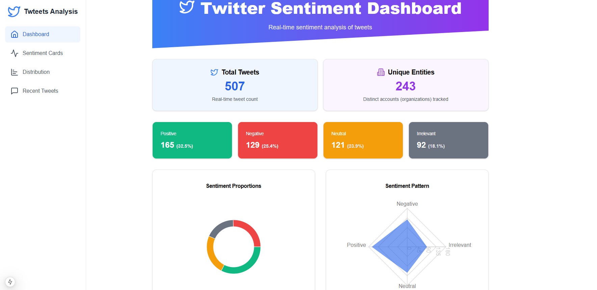
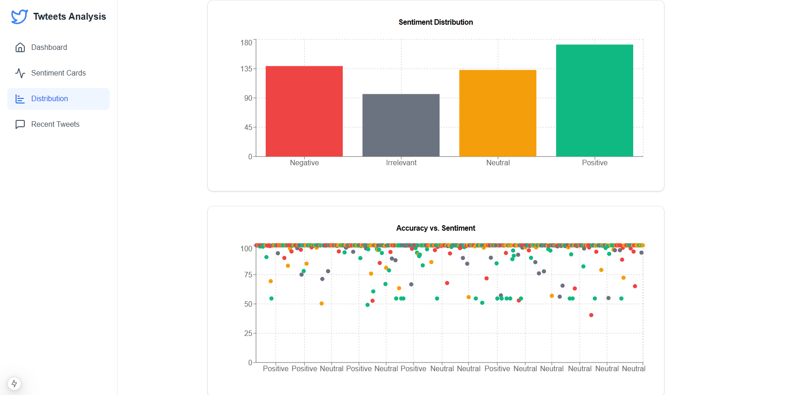
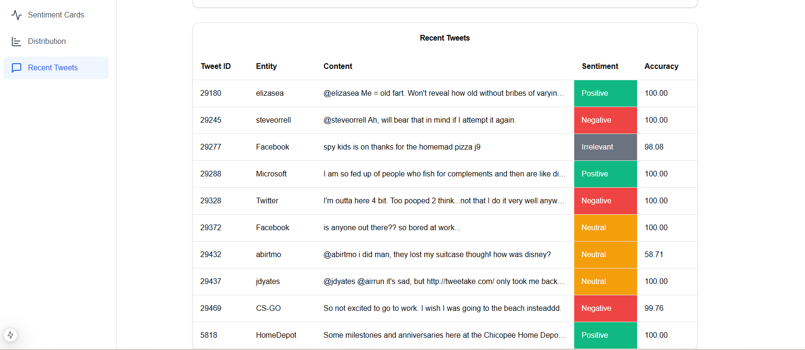

# Twitter Data Integration Web App

A real-time data processing and visualization platform that demonstrates semantic interoperability by integrating and transforming Twitter data across multiple systems. The architecture leverages Apache Kafka for streaming, Spark for processing, PostgreSQL and MongoDB for storage, with data seamlessly flowing between components through standardized formats and protocols. The insights are displayed through a modern web interface built with Flask and Next.js, showcasing end-to-end system integration and data interoperability.







## Project Architecture

### Backend Components
- **Kafka Producer**: Ingests data from CSV files and streams it in real-time
- **Kafka Consumer**: Processes streaming data using Apache Spark  
- **Flask API**: Serves processed data to the frontend
- **Machine Learning Model**: Performs sentiment analysis on Twitter data

### Frontend Component
- **Next.js Dashboard**: Visualizes data and analysis results in real-time

### Data Storage
- **PostgreSQL**: Stores structured Twitter data
- **MongoDB**: Stores processed results and analysis

## Project Structure
```bash
    TwitterDataIntegration-WebApp/
    ├── _back-end/
    │   └── app.py
    ├── _front-end/
    ├── data_consumer/
    │   ├── lr_model/
    │   ├── kafka_consumer.py
    │   └── requirements.txt
    ├── data_producer/
    │   ├── Dataset/
    │   │   ├── twitter_training.csv
    │   │   └── twitter_validation.csv
    │   ├── Dockerfile
    │   ├── kafka_producer.py
    │   └── requirements.txt
    ├── postgesDB_data_storage/
    ├── .gitignore
    ├── docker-compose.yml
    └── README.md
```

## Technologies Used

- Python
- Apache Kafka
- Apache Spark
- PostgreSQL
- MongoDB
- Docker
- Flask (Backend)
- Next.js (Frontend)

## Features

- Real-time data streaming with Kafka
- Sentiment analysis using machine learning
- Interactive data visualization
- Scalable data processing with Spark
- Containerized deployment with Docker

## Prerequisites

- Docker and Docker Compose
- Python 3.8+
- Node.js 14+
- PostgreSQL
- MongoDB

## Installation

1. Clone the repository:
```
    git clone https://github.com/amine-sabbahi/TwitterDataIntegration-WebApp.git
    cd TwitterDataIntegration-WebApp
```
2. Set up environment variables:
```
    git clone https://github.com/amine-sabbahi/TwitterDataIntegration-WebApp.git
    cd TwitterDataIntegration-WebApp
```

3. Build and run the containers with Docker Compose:
```
    docker-compose up --build
```
4. Run the Backend server:
```
    cd _back-end
    python app.py
```
5. Run the frontend server:
```
    cd _front-end
    npm install
    npm run dev
```

6. Access to the Dashboard
```
http://localhost:3000/
```

## Contributors


   - [Mohamed Amine Sabbahi](https://github.com/amine-sabbahi).

   - [Aymane Mahri](https://github.com/AymaneM21).

  - [NIDAR SALMA](https://github.com/salma31nidar).

  - [BAKKALI AYOUB](https://github.com/BAKKALIAYOUB).


---

**Abdelmalek Essaadi University** Faculty of Sciences and Techniques
   - Department : Computer Engineering
   - Master : AI & DS
   - Module : Data Spaces
   - Framed by : Pr. Wafae Baida